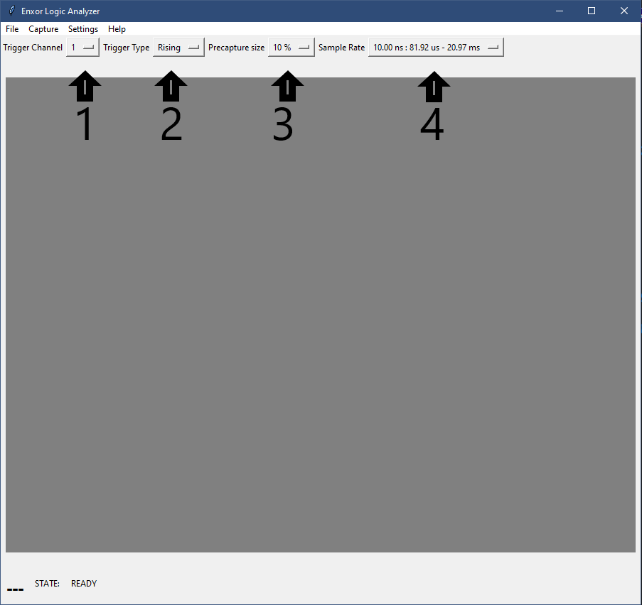
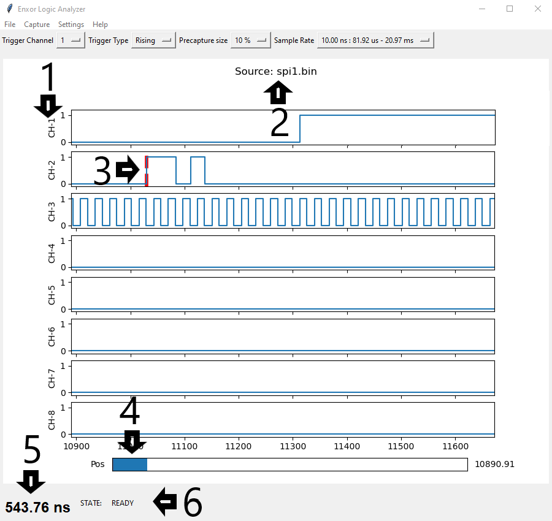
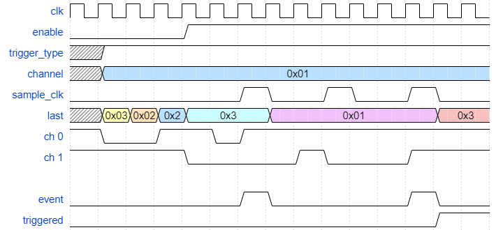
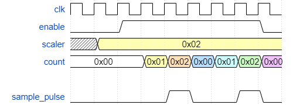
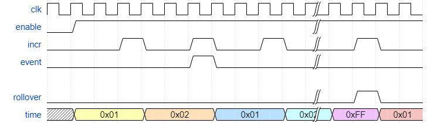
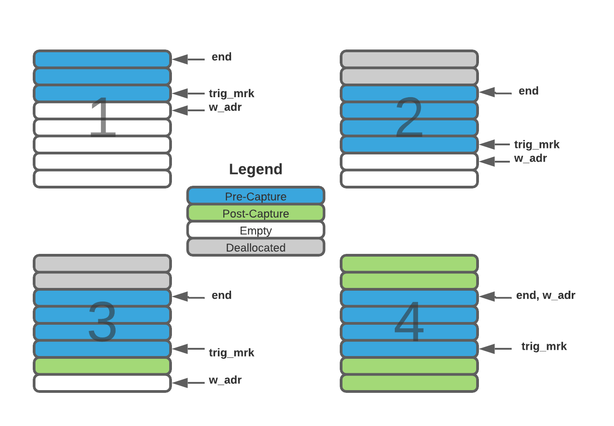

# Enxor-Logic-Analyzer
### By: Matthew Crump
---
## Contents
1. [Overview](#overview)
2. [FPGA Utilization](#fpga-utilization)
3. [Warnings](#warnings)
4. [Installation](#installation)
5. [Run](#run)
6. [Design Breakdown](#design-breakdown)
7. [Specifications](#specifications)
8. [Customize](#customize)
9. [Potential Enhancements](#potential-enhancements)
10. [Known Issues](#known-issues)
---
## Overview
Electronic hobbyists, makers, and engineering students need low-cost and effective tools. One of these tools includes a logic analyzer for debugging digital designs. Unfortunately, there is a large gap in this market, professional grade logic analyzers start at a minimum of 400 dollars while the cheaper version is around 15 dollars but is extremely limited in functionality. There are no mid-tier options that meet the needs of the aforementioned. This project is an open-source design using FPGAs offering great performance. In addition, the design uses only Verilog source code, no IP cores or device specific features. This makes the design portable to any FPGA, you can adjust the number of input channels and memory depth very quickly. For the accompanying desktop application, Python is used to allow the GUI to work on most operating system.

---
## Warnings
  * Caution: Connecting one or more of the input channels to voltages outside the range of your FPGA, even for a very short time, can result in permanent damage to either device.
  * The input channels of the FPGA are not electrically isolated from each other, nor are they isolated from the PC.
  * Be aware of ground loops! Read more about it [here](https://en.wikipedia.org/wiki/Ground_loop_%28electricity%29)

---
## FPGA Utilization
  | Manufacture | Family | Device | Frequency | WNS | LUT | FF | Channels | Memory Depth
  | --------- | --------- | --------- | --------- | --------- | --------- | --------- | --------- | --------- |
  | Xilinx | Artix-7 | xc7a35tcpg236-1 | 100MHz | 4.313 | 198 | 223 | 8 | 4096
  | Xilinx | Artix-7 | xc7a35tcpg236-1 | 100MHz | 4.271 | 201 | 228 | 8 | 8192
  | Xilinx | Artix-7 | xc7a35tcpg236-1 | 100MHz | 4.098 | 200 | 240 | 16 | 4096
  | Altera | Cyclone IV | EP4CE10F17C8N | 50MHz | 10.729 | 404 | 238 | 8 | 8192
  | Lattice | iCE40 | LP8K | 16MHz | x | 665 | 234 | 8 | 8192
  
---
## Installation
* Python 3.6 or higher is required to run the GUI. Required Python packages:
  * matplotlib: version >= 3.2.0 
  * tkinter: version >= 8.6
* The FPGA development tools vary depending on the manufacture.
  * Xilinx -> Vivado
  * Altera -> Quartus Prime
  * Lattice -> icestudio or Icecube2
---
## Run
* Launch the GUI by running:
  * ```$ python3 gui.py```
  * Make sure that the ```config.json``` is in the same directory as ```gui.py``` before running and that it has values for each of these fields: ```clk_freq```, ```mem_depth```, and ```num_channels```. Those fields are required and are explained in [Specifications](#specifications) section of this README.
* ### How to use the GUI!
* Top tool bar
  * File:
    * Open: Loads a configuration file.
    * Save As: Saves the current settings to a configuration file.
    * Exit: Closes the program.
  * Capture:
    * Start: Starts a capture with the current settings.
    * Stop: Stops a capture, if a trigger event occurred then the data that was recorded is sent over.
    * Open: Loads a saved waveform and displays it.
    * Save As: Saves the current waveform to a binary file.
  * Settings:
    * Serial Ports: Selects which serial port the logic analyzer is connected to.
  * Help:
    * Has a link to the GitHub repository.
* Main menu caputre buttons
  * 1: Selects which channel to watch for a trigger condition.
  * 2: Sets if the trigger type is a rising or falling edge.
  * 3: Sets the ratio of data that will be before a trigger event. 
  * 4: Sets the sample rate, first number shows the sample interval rate, the next two numbers show the minimum and maximum record time respectivley.

  

* Waveform Window
  * 1: The channel name.
  * 2: Indicates where the data came from. Is set to the filename if loaded from one or is Enxor if the data came directly from the logic analyzer.
  * 3: The red bar indicates where the trigger point occured.
  * 4: The position slider controls the x-axis. Click-and-drag to move the slider to a new location.
  * 5: Time measurement with units. Click anywhere on the waveform and then click on a second point to show the time between the two points.
  * 6: Indicates the status of the logic analyzer. The ```READY``` status indicates that the logic analyzer is ready to start a capture. When the logic analyzer is enabled but has not triggered yet, the status will be ```WAITING```. After a trigger event, the status will be ```TRIGGERED```. If you stop a capture in the middle then the status will be ```STOPPED```.

  

---
## Design Breakdown
This project consists of 7 major blocks to carry out a functional logic analyzer: a trigger controller, sample rate counter, memory buffer, control module, and UART communication.
* ### Trigger Controller<br>
  This module is set to wait for a trigger condition on a user configurable channel. That condition can be either a falling or rising edge and is set in the GUI. A sample rate signal is used to tell the trigger controller when to shift new input data in. If the new data does not match the current data, then an event signal is sent out to other blocks. Once the trigger condition occurs, a triggered state signal is sent to the memory buffer.
  
* ### Sample Rate Counter<br>
  This system takes in a 16-bit divisor that tells the logic analyzer what the sample frequency should be. The sample rate signal controls how often new data is shifted into the trigger controller and how often the timestamp counter should be incremented. This divisor is needed with the FPGA clock frequency, in the GUI, to derive timing information from the relative timestamps. The sample rate signal is a pulse lasting for one clock period of the FPGA system clock, the signal does not drive the clock of any connected blocks. This helps avoid crossing clock domains as all blocks run at the same frequency.
  
* ### Timestamp Counter<br>
  This system uses an 8-bit register to count the number of sample clock pulses. This register is concatenated together with the input data before being saved to the memory buffer. The timestamp counter is incremented at every sample clock to keep track of the relative time between events. If an event occurs the counter is reset to 1 and resumes counting. If the counter overflows, a signal is raised for the memory controller to start a new entry in the buffer. An enable signal is used to hold the counter at 1 until a capture has been started.
  
* ### Memory Buffer<br>
  The memory buffer combines the timestamp and data storing it in RAM. Each time it receives an event or timestamp rollover signal, a new row in the buffer is started. Before a trigger condition occurs, this block behaves as a circular buffer, continually overwriting previous entries. The size of this circular buffer is programmable in the GUI and is a ratio of the entire buffer from 10% to 90%.  Once a trigger condition occurs, the buffer acts as a FIFO, filling the remaining memory up. Once full, the controller module is signaled, and data is read out row by row.
  
* ### Data Width Converter<br>
  This block takes the width of the memory buffer data and converts it into 8-bit chunks so that the UART module can easily send data out. The data width converter also uses full-handshake protocol to securely transfer data from the memory buffer to the UART and to wait for the serial data to send before fetching the next entry. While it converts the width, it also prepends a header on the captured data indicating if it was captured before or after the trigger event.
* ### FSM Controller<br>
  This block waits for commands to be received from the host computer and saves the commands to control registers. Once the enable command is received, the controller waits for the memory buffer to fill up. Then the data is read out of the buffer and converted from its original width to a width of one byte to be sent off to the UART block.
* ### UART Communication<br>
  This block simply waits for bytes to be sent from the host PC and relays the commands to the controller block. This block is signaled from the data width converter when captured data is ready to be sent out. The BAUD rate of the serial data is set through a parameter called CLKS_PER_BIT and can be found by taking the FPGA clock frequency divided by the desired BAUD rate and then divided by 2 once more.
---
## Specifications
* Timming <br>
Data sent back to the host PC has a relative sample time count byte. Each time unit is equal to
  * ```time_unit_in_seconds = 1 / (clock_freq/sample_divisor)```

  The minimum and maximun sample time in seconds can be found by the following equations.
  * ```min_record_time = memory_depth / (clock_freq/sample_divisor)```
  * ```max_record_time = (max_timestamp_value * memory_depth) / (clock_freq/sample_divisor)```
* Config Format<br>
Current settings can be saved or loaded from a ```json``` file. The following table explains what each field is and if it is required.
  | Field | Description | Default | Required |
  | --------- | --------- | --------- | --------- |
  | baud_rate   | the baud rate of the FPGA UART | 115200 | N
  | port_name   | the name of the serial port, i.e. ```COM4``` or ```ttyUSB0``` | None | N
  | precap_size | number of rows in the buffer that will be used for data captured before a trigger condition | 4 | N
  | sample_scaler | number to divide the clock frequency. Sample frequency in seconds is given by 1 / (clk_freq/sample_rate) | 1 | N
  | trig_channel | the channel to watch for a trigger condition | 0 | N
  | trig_type | specifies if the trigger condition is a rising ```1``` or falling ```0``` edge | 1 | N
  | clk_freq | the clock frequency of the FPGA design in Hertz | N/A | Y
  | mem_depth | the depth of the memory buffer | N/A | Y
  | num_channels | the number of input channels to the FPGA | N/A | Y

* Saved Capture File Format<br>
  Several logic anaylzer settings are saved along with the captured data to a bin file. The following table shows the byte ordering.
  | Byte | Description | 
  | --------- | --------- |
  | 1 | number of input channels |
  | 2 | trigger channel |
  | 3 | exponent for base 2 to get the memory buffer depth |
  | 4-7 | the FPGA clock frequency in Hertz, stored in little-endian |
  | 8-9 | the sample rate the data was captured at, stored in little-endian |
  The remaining bytes follow the next subsection's format.

* Captured data transmitted to host PC from the FPGA.
  | Byte | Description | 
  | --------- | --------- |
  | 1 | indicates if the following data is captured before or after the tigger point <br> Precapture = ```0xA1``` <br> PostCapture = ```0xA3``` |
  | N | The next byte(s) is the captured data. The number of bytes is given by the number of channels divided by 8 |
  | 3 | Last byte contains the count of the sample clock ticks fo the dat. The timestamps ranges are ```1-255``` |

---
## Customize
* In the LogicAnalyzerTop moduler are parameters that allow easy customization of the design.
  * ```DATA_WIDTH``` This is the number of input channels to the FPGA and must be divisible by 8, i.e. [8, 16, 24, 32]
  * ```MEM_DEPTH``` This is the number of rows in the memory buffer. Total bytes in the buffer is ```MEM_DEPTH``` * (```DATA_WIDTH```/8 + 1)
* The UART requires a parameter called ```CLKS_PER_BIT```. To get the correct BAUD rate the following formula is used.
  * ```CLKS_PER_BIT``` = (Frequency of FPGA)/(Frequency of UART)
  * Example: <br>10 MHz Clock, 115200 baud UART <br> 10000000 / 115200 = 87

## Potential Enhancements
* Add a small soft-core processor to make communicating with the host PC easier and more flexible.
* Add protocol decoding

## Known Issues
* If a data capture does not contain the full memory of the FPGA, errors occur why writting the data to or from a file
  * Potential fix: dynamically write or read the amount of data in the file rather than hard-coded to the size of the memory
  * Status: Resolved
* If a trigger condition occurs within microseconds after being enabled, the gui cannot get the serial port open intime to catch all the data.
  * Potential fix: have Enxor signal the host PC that the buffer is full then wait for a read command before sending captured data.
  * Status: Resolved
